# HotelSaver.ng - Hotel Booking & Negotiation Platform

[](https://github.com/manzez/hotelsaver1/actions/workflows/ci-cd-pipeline.yml)
[](https://hotelsaverversion-azhmsv4o5-amanzes-projects-2bbd5fbf.vercel.app)
[](#-cicd-pipeline--automated-testing)
[](https://nextjs.org/)
[](https://www.typescriptlang.org/)

## 🌟 Welcome to HotelSaver.ng

**HotelSaver.ng** is Nigeria's first intelligent hotel booking platform that empowers travelers to negotiate better prices in real-time. Built specifically for the Nigerian market, our platform revolutionizes how people book accommodations by introducing transparent price negotiation, local service integration, and culturally-relevant travel solutions.

### 🎯 What Makes HotelSaver.ng Unique?

Unlike traditional booking platforms where prices are fixed, HotelSaver.ng allows users to negotiate hotel rates directly through our smart algorithm. Users can see potential savings upfront and secure better deals through our time-limited negotiation system - all while supporting local Nigerian businesses.

### 🏨 Our Mission

To democratize travel in Nigeria by:
- **Making luxury accessible** - Enable travelers to afford better accommodations through negotiation
- **Supporting local businesses** - Connect Nigerian hotels and service providers with customers
- **Cultural authenticity** - Showcase Nigeria's rich hospitality and cuisine heritage
- **Transparent pricing** - No hidden fees, clear breakdown of costs including Nigerian VAT

### 🌍 Target Market & Coverage

**Primary Markets:**
- **Lagos** - Nigeria's commercial hub with 40+ premium hotels
- **Abuja** - Federal capital serving government and business travelers  
- **Port Harcourt** - Oil industry center with corporate accommodation needs
- **Owerri** - Growing regional market with emerging hospitality sector

**User Demographics:**
- Business travelers seeking better corporate rates
- Leisure travelers wanting luxury experiences at affordable prices
- Event planners booking multiple rooms for weddings/conferences
- International visitors exploring Nigeria's major cities

### 💡 How It Works - The Magic Behind Negotiation

```
1. 🔍 Smart Search → AI-powered hotel matching based on preferences
2. 💰 Real-time Pricing → See both regular and potential negotiated prices
3. ⚡ Instant Negotiation → 5-minute countdown creates urgency for better deals
4. 🎉 Confirmed Savings → Lock in discounts up to 50% off regular rates
5. 📱 Seamless Booking → Complete reservation with preserved negotiated price
```

**The Algorithm:**
- **Premium hotels** (15 properties) maintain fixed luxury pricing
- **Negotiable hotels** (105+ properties) offer dynamic discounts based on availability, seasonality, and demand
- **Time pressure** creates win-win scenarios for both travelers and hotels

### 🎨 For New Developers - What You're Working On

If you're joining our development team, you're building more than just another booking site. You're creating:

**🏗️ A Complex Booking Engine** with real-time price calculations, multi-night stays, tax computations, and dynamic discount applications.

**📱 Mobile-First Experience** optimized for Nigerian users who primarily browse on mobile devices, with native date pickers and responsive design.

**🔐 Social Authentication** integrated with NextAuth.js supporting Google, Facebook, and Instagram - crucial for building trust in the Nigerian market.

**💾 Smart State Management** using URL-based persistence and localStorage to ensure users never lose their search progress.

**🎯 Nigerian Business Logic** including Naira currency formatting, 7.5% VAT calculations, and local service categories like hair braiding, massage, and security services.

### 🚀 Quick Start for New Team Members

```bash
# 1. Get the code
git clone <repository-url>
cd hotelsaver-ng-v9

# 2. Install everything
npm install

# 3. Start developing
npm run dev
# Visit: http://localhost:3000

# 4. Run tests to understand the codebase
npm run test

# 5. Build for production
npm run build
```

**🔥 Pro Tips for New Developers:**
- Start by exploring the `/app` directory to understand the page structure
- Check `/lib/discounts.ts` to see how negotiation logic works
- Look at `/components/SearchBar.tsx` for complex form state management
- Test the negotiation flow at `/negotiate` to understand the core feature
- Review `lib.hotels.json` and `lib.services.json` for data structure

### 🎯 Current Development Focus

We're actively working on:
- **Enhanced mobile experience** with better touch interactions
- **Advanced filtering** for amenities, hotel types, and price ranges
- **Loyalty program** integration for repeat customers
- **Multi-language support** (English, Igbo, Yoruba, Hausa)
- **Payment integration** with Nigerian payment gateways
- **Inventory management** for real-time availability

---

## 📖 Application Overview

HotelSaver.ng is a Next.js 14 hotel booking platform that allows users to negotiate hotel prices and book local services across Nigeria. The platform focuses on four major Nigerian cities: Lagos, Abuja, Port Harcourt, and Owerri.

### 🏗️ Architecture & Key Features

#### **Core Functionality**
- **Hotel Search & Filtering**: Search hotels by city, budget range, guest count, and stay type
- **Smart Negotiate System**: Only hotels with available discounts show negotiate buttons
- **Real-time Negotiation**: Dynamic discount application with time-limited offers (5-minute expiry)
- **Search Data Persistence**: Form data preserved when navigating between pages
- **Mobile-First Design**: Native date pickers on mobile, responsive design with fixed header
- **Service Booking**: Local services like beauty, massage, catering, security
- **Food Ordering**: Nigerian cuisine with location-based filtering
- **Social Authentication**: Google, Facebook, Instagram login with NextAuth.js

#### **Technical Stack**
- **Frontend**: Next.js 14 (App Router), React 18, TypeScript
- **Styling**: Tailwind CSS with custom utility classes
- **Authentication**: NextAuth.js with OAuth providers (Google, Facebook, Instagram)
- **State Management**: URL-based state with React hooks, localStorage persistence
- **Date Handling**: react-datepicker with mobile fallbacks
- **Image Handling**: SafeImage component with fallback support
- **Deployment**: Vercel with automatic builds

#### **Business Logic**
- **Pricing**: Nigerian Naira (₦) with 7.5% VAT on multi-night stays
- **Discounts**: Selective negotiation system - premium hotels have fixed pricing, others offer 10-50% discounts
- **Cities**: Lagos, Abuja, Port Harcourt, Owerri
- **Budget Ranges**: Under ₦80k, ₦80k-₦130k, ₦130k-₦200k, ₦200k+
- **Hotel Categories**: 120+ hotels with 15 premium properties having fixed pricing, others negotiable

### 🗺️ User Journey Flow

```
1. Homepage → Search Form (City, Dates, Guests, Budget)
2. Search Results → Hotel Cards with Smart Negotiate/Book Buttons
3. Hotel Details → View Images, Amenities, Pricing Options
4. Negotiation → Real-time discount with 5-minute countdown timer (if available)
5. Booking → Contact form with preserved negotiated price
6. Confirmation → Booking ID and email confirmation
7. Authentication → Optional social login for personalized experience
```

### 📱 Key Pages & Components

#### **Primary Pages**
- `/` - Homepage with hero search and featured hotels
- `/search` - Hotel search results with smart filtering and negotiate/book buttons
- `/hotel/[id]` - Hotel detail page with gallery and conditional pricing
- `/negotiate` - Real-time negotiation with progress (fixed header overlap issue)
- `/book` - Booking form with contact details and price preservation
- `/services` - Local service marketplace with Nigerian providers
- `/food` - Nigerian food ordering with traditional cuisine
- `/auth/signin` - Authentication page with social login options

#### **Core Components**
- `SearchBar` - Complex form with device-specific date pickers and localStorage persistence
- `ClientLayout` - Header with mobile hamburger menu and fixed sticky positioning
- `SafeImage` - Client-side image component with automatic fallbacks
- `CategoryTabs` - Navigation between Hotels/Services/Food
- `UserMenu` - Authentication interface with social login and clean UI
- `AuthProvider` - NextAuth.js wrapper for session management

---

## 🚀 CI/CD Pipeline & Automated Testing

HotelSaver.ng features a **production-ready CI/CD pipeline** with comprehensive regression testing that ensures zero-downtime deployments and prevents bugs from reaching production.

### 🎯 Pipeline Overview

Our **5-stage automated pipeline** runs on every code change:

```mermaid
graph TD
    A[Code Push] --> B[🧪 Regression Tests]
    B --> C[🔍 Code Quality]
    C --> D[🚀 Staging Deploy]
    D --> E[🌟 Production Deploy]
    E --> F[📊 Test Reports]
```



#### **Stage 1: 🧪 Regression Testing** (Parallel Execution)
- **API Tests**: Backend endpoint validation (15 tests, ~2 min)
- **E2E Core Tests**: Search, negotiation, booking flows (25 tests, ~5 min)
- **Mobile Tests**: Cross-device compatibility (20 tests, ~4 min)
- **Total Coverage**: 150+ automated test cases

#### **Stage 2: 🔍 Code Quality & Security**
- **TypeScript**: Strict type checking and compilation
- **ESLint**: Code style and best practices validation
- **Security Audit**: Dependency vulnerability scanning
- **Bundle Analysis**: Performance optimization checks

#### **Stage 3: 🚀 Staging Deployment**
- **Preview Environment**: Vercel staging URL
- **Smoke Tests**: Basic functionality verification
- **PR Integration**: Automatic staging links in pull requests

#### **Stage 4: 🌟 Production Deployment**
- **Zero-Downtime**: Seamless production updates
- **Post-Deploy Testing**: Live environment validation
- **Automatic Rollback**: On critical failures

#### **Stage 5: 📊 Test Results & Reporting**
- **GitHub PR Comments**: Automatic test result summaries
- **HTML Reports**: Detailed test execution reports with screenshots
- **Failure Analysis**: Videos and traces for debugging

### 🛡️ Quality Gates

**✅ Deployment Blockers (Must Pass):**
- All API regression tests pass
- Core user journeys work end-to-end
- TypeScript compilation succeeds
- Application builds without errors

**⚠️ Warnings (Non-blocking):**
- Code linting issues
- Security audit findings
- Mobile compatibility warnings
- Bundle size optimization suggestions

### 🔧 Local Development Workflow

#### **Pre-Commit Testing**
```bash
# Run complete regression test before pushing
./pre-deploy-validation.sh

# This automatically:
# ✅ Builds the application
# ✅ Starts test server
# ✅ Runs API tests
# ✅ Runs E2E tests
# ✅ Generates detailed reports
# ✅ Confirms deployment readiness
```

#### **Selective Testing**
```bash
# Test specific areas during development
npm run test:api          # Backend validation only
npm run test:search       # Search functionality
npm run test:booking      # Negotiation + booking flow
npm run test:mobile       # Mobile experience
npm run test:regression   # Full regression suite
```

### 📊 Pipeline Monitoring

#### **GitHub Actions Dashboard**
- **Real-time Logs**: Watch tests execute live
- **Parallel Execution**: Multiple test suites run simultaneously
- **Artifact Downloads**: Test reports, screenshots, videos
- **Status Badges**: Visual pipeline status in README

#### **Pull Request Integration**
Every PR automatically shows:
```
🧪 Test Results Summary
┌─────────────────┬─────────┐
│ Test Suite      │ Status  │
├─────────────────┼─────────┤
│ API Tests       │ ✅ 28/28│
│ E2E Core        │ ✅ 25/25│
│ Mobile Tests    │ ✅ 20/20│
│ Code Quality    │ ✅ Pass │
└─────────────────┴─────────┘

🚀 Staging URL: https://staging-xyz.vercel.app
📊 Success Rate: 100% | Duration: 8m 34s
```

#### **Vercel Dashboard**
- **Deployment History**: All staging and production deployments
- **Build Logs**: Detailed deployment progress
- **Performance Metrics**: Core Web Vitals and loading times
- **Environment Variables**: Secure configuration management

### 🚨 Failure Handling & Recovery

#### **Automated Failure Detection**
- **Test Failures**: Detailed error logs with screenshots
- **Build Failures**: TypeScript and compilation errors
- **Deployment Failures**: Rollback to last known good state
- **Performance Regressions**: Bundle size and load time alerts

#### **Quick Recovery Procedures**
```bash
# Emergency hotfix deployment
vercel --prod

# Rollback to previous version
vercel rollback [deployment-url]

# Debug failed tests locally
npm run test:debug
npm run test:headed  # Visual debugging
```

### 🎯 Pipeline Configuration

#### **Environment Variables** (GitHub Secrets)
```bash
VERCEL_TOKEN=your_deployment_token
VERCEL_ORG_ID=your_organization_id
VERCEL_PROJECT_ID=your_project_id
```

#### **Supported Triggers**
- **Push to main**: Full pipeline → Production deployment
- **Pull Request**: Full pipeline → Staging deployment
- **Manual Trigger**: On-demand pipeline execution
- **Scheduled**: Nightly regression tests (optional)

### 🎉 Benefits Achieved

**✅ Zero Production Bugs**: All changes tested before deployment
**⚡ Fast Feedback**: Know within 10 minutes if code works
**🔒 Secure Deployments**: Automated security scanning
**📱 Cross-Device Testing**: Mobile, tablet, desktop validation
**👥 Team Collaboration**: PR comments with test results
**📈 Continuous Improvement**: Test metrics and performance tracking

### 📚 Documentation & Setup

- **Complete Setup Guide**: [`CI-CD-SETUP.md`](./CI-CD-SETUP.md)
- **Implementation Details**: [`CICD-IMPLEMENTATION-SUMMARY.md`](./CICD-IMPLEMENTATION-SUMMARY.md)
- **Pipeline Configuration**: [`.github/workflows/ci-cd-pipeline.yml`](./.github/workflows/ci-cd-pipeline.yml)
- **Local Testing Script**: [`pre-deploy-validation.sh`](./pre-deploy-validation.sh)

---

## 🧪 Test Automation Suite

This project includes a comprehensive Playwright-based testing suite covering UI interactions, API endpoints, and end-to-end user journeys with both positive and negative test scenarios.

### 📋 Test Coverage Areas

1. **Search & Filtering** - Date calculations, city selection, budget ranges
2. **Hotel Details** - Image loading, pricing accuracy, amenity display
3. **Negotiation Flow** - Discount calculations, timer functionality, expiry
4. **Booking Process** - Form validation, price preservation, confirmation
5. **Mobile Experience** - Native date pickers, hamburger menu, responsiveness
6. **API Endpoints** - All backend services and data validation
7. **Edge Cases** - Network failures, expired sessions, invalid data

### 🚀 Quick Start Testing

```bash
# Install dependencies
npm install

# Install Playwright
npm run test:install

# Run all tests
npm run test

# Run specific test suite
npm run test:search
npm run test:booking
npm run test:api

# Run tests in headed mode (see browser)
npm run test:headed

# Generate test report
npm run test:report
```

---

## 📊 Test Metrics & Reporting

- **Total Test Cases**: 150+
- **Coverage Areas**: 8 major user journeys
- **API Endpoints**: 6 endpoints tested
- **Device Testing**: Desktop, Mobile, Tablet
- **Browser Coverage**: Chrome, Firefox, Safari, Mobile browsers

### 🎯 Test Results Dashboard

After running tests, view results at: `./playwright-report/index.html`

---

## 🔧 Development Setup

```bash
# Clone repository
git clone <repository-url>
cd hotelsaver-ng-v9

# Install dependencies
npm install

# Start development server
npm run dev

# Build for production
npm run build

# Start production server
npm start
```

### 🚀 CI/CD Development Workflow

```bash
# Before pushing code, run regression tests
./pre-deploy-validation.sh

# Or run individual test suites
npm run test:api          # Backend validation (fast)
npm run test:regression   # Complete test suite
npm run ci:setup          # Install all test dependencies

# Deploy with confidence
git add .
git commit -m "Your changes"
git push origin main      # Triggers automatic deployment
```

**Pipeline Execution**: Check [GitHub Actions](https://github.com/manzez/hotelsaver1/actions) for real-time progress

### 🌐 Environment URLs

- **Development**: http://localhost:3000
- **Production**: https://hotelsaverversion-oyek4s5ad-amanzes-projects-2bbd5fbf.vercel.app

---

## 📞 Support & Contact

- **Customer Support**: https://wa.me/2347077775545
- **Email**: [Contact form on website]
- **Documentation**: This README and inline code comments

---

## 🏷️ Version Information

- **Application Version**: v9
- **Next.js**: 14.2.33
- **Node.js**: >=18.0.0
- **Last Updated**: October 18, 2025
- **Recent Updates**: 
  - Fixed selective negotiate buttons (only show for discounted hotels)
  - Resolved authentication server configuration errors
  - Added search data persistence across navigation
  - Fixed header overlap issue on negotiate page
  - Deployed latest version to production
