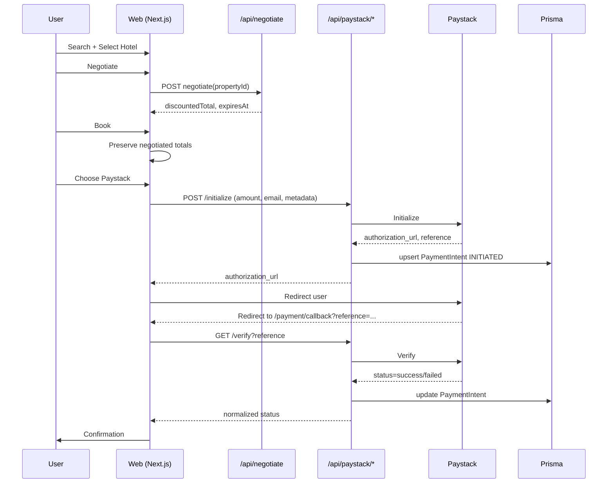

# Architecture Overview

This document explains the overall architecture, data flow, and key patterns used in HotelSaver.ng.

## Contents

- Core Workflow
- Data Sources
- Discount System
- State Management
- VAT and Totals
- Pages and Components
- API Routes
- Error Handling & Safety
- Styling & UX
- Testing
- Deployment Notes

## Core Workflow

Search → Negotiate → Book → Payment → Confirmation

- Search (`/search`): city, dates, guests, budget, stay type; filters hotels from static JSON; URLSearchParams preserves state.
- Negotiate (`/negotiate`): calls `/api/negotiate` → returns discounted price and 5-minute expiry; client shows countdown and preserves context.
- Book (`/book`): captures contact info; carries negotiated totals forward.
- Payment (`/payment`): choose Pay at Hotel or Paystack; shows summary, VAT, totals.
- Confirmation (`/confirmation`): final breakdown with bookingId/payment method.

## Data Sources

- Hotels: `lib.hotels.json` (supports `basePriceNGN` or `price`)
- Services: `lib.services.json`
- Discounts: `lib/discounts.json` consumed via `lib/discounts.ts`
- Persistence: Prisma minimal `PaymentIntent` for payment lifecycle

## Discount System

- Always use `getDiscountFor(propertyId)` in `lib/discounts.ts`
- Default 15% unless overridden by `discounts.json`
- Negotiated totals are rounded to nearest Naira

```
const discount = getDiscountFor(propertyId) // 0.15 default or override
const discounted = Math.round(base * (1 - discount))
```

### Sequence Diagram



## State Management

- URL-based state across pages via `URLSearchParams`
- No global store; pages read parameters defensively with defaults
- Client-only widgets (datepicker) use dynamic import with `ssr: false`

## VAT and Totals

- VAT rate: 7.5%
- Applied only to multi-night stays
- Display: base subtotal, VAT line, grand total

## Pages and Components

- `components/SearchBar.tsx`: complex controlled form; builds search URL
- `components/CategoryTabs.tsx`: section navigation with active state
- `components/ClientDatepicker.tsx`: SSR-safe wrapper

Pages (App Router):
- `/`: hero + search, featured hotels/services
- `/search`: filtered results
- `/hotel/[id]`: detail page
- `/negotiate`: discount + countdown
- `/book`: booking form
- `/payment`: method selection + redirect to Paystack
- `/payment/callback`: client verifies reference and forwards
- `/confirmation`: summary

## API Routes

- `POST /api/negotiate`: validates property; computes discounted price; returns `expiresAt` (5 minutes)
- `POST /api/book`: minimal acceptance; returns bookingId placeholder
- `POST /api/services/search`: text search; limited results
- `POST /api/services/book`: flexible JSON/FormData; returns reference
- `POST /api/paystack/initialize`: server-side init; stores PaymentIntent
- `GET /api/paystack/verify`: verifies reference; updates PaymentIntent
- `POST /api/paystack/webhook`: signature-verified reconcile; updates PaymentIntent and stores raw payload

## Error Handling & Safety

- Defensive access for mixed `basePriceNGN` vs `price`
- URL param fallbacks and type coercion
- Countdown timers are always cleaned up on unmount
- API routes return structured reason codes for debugging

## Styling & UX

- Tailwind utility classes with brand palette
- Mobile-first; responsive grids and buttons
- Nigerian Naira display: `₦{amount.toLocaleString()}`

## Testing

- Playwright happy-path E2E: Pay at Hotel deterministic path
- API scripts cover negotiation and booking basics

## Deployment Notes

- Next.js 14 on Vercel
- `postinstall` runs `prisma generate` for Prisma Client availability
- ESLint can be ignored during build via Next config; lint fixes ongoing
